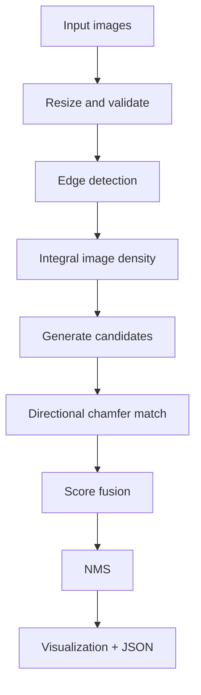

# Pipeline Diagram

```mermaid
flowchart TD
    A[Input images] --> B[Resize and validate]
    B --> C[Edge detection]
    C --> D[Integral image density]
    D --> E[Generate candidates]
    E --> F[Directional chamfer match]
    F --> G[Score fusion]
    G --> H[NMS]
    H --> I[Visualization + JSON]
```
