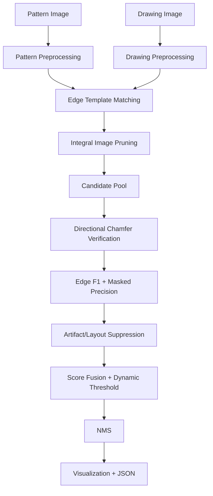

# Pipeline Diagram

```mermaid
flowchart TD
    A[Pattern Image] --> B[Pattern Preprocessing]
    C[Drawing Image] --> D[Drawing Preprocessing]
    B --> E[Edge Template Matching]
    D --> E
    E --> F[Integral Image Pruning]
    F --> G[Candidate Pool]
    G --> H[Directional Chamfer Verification]
    H --> I[Edge F1 + Masked Precision]
    I --> J[Artifact/Layout Suppression]
    J --> K[Score Fusion + Dynamic Threshold]
    K --> L[NMS]
    L --> M[Visualization + JSON]
```
