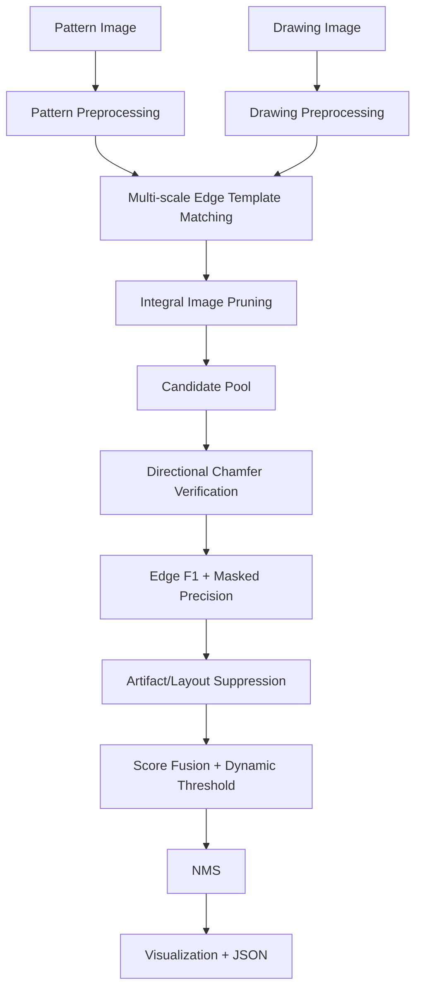

# System Design

## Executive Summary
This project implements a zero-shot, CPU-only detector for BOM and schematic symbols. The approach is geometry-first: edge preprocessing, multi-scale template matching for candidate generation, and a verification tier that uses directional chamfer matching plus edge-based metrics. The system is deterministic, requires no model weights, and is designed for interactive review workflows.

## Problem Understanding
Inputs are a small query pattern image and a large drawing image. Output is a set of bounding boxes with confidence scores, a visualization image, and a JSON report. The solution must operate without training, avoid heavyweight models, and remain CPU-friendly with practical runtime.

## Challenges of BOM Technical Drawings
- Line-dominated images with low texture
- Dense tables, title blocks, and text labels that create false positives
- Variability in symbol scale and rotation
- Thin strokes that can be lost during preprocessing

## Comparison of Approaches
### Template Matching (Classic)
Pros: deterministic, fast, works well for edges
Cons: sensitive to rotation and noise without verification

### SIFT/ORB
Pros: rotation and scale invariance in natural images
Cons: weak on line drawings and low-texture symbols

### Deep Foundation Models
Pros: strong generic localization
Cons: GPU/weights/training requirements violate constraints

### Selected Architecture
Hybrid edge template matching with directional chamfer verification and artifact suppression.

## Pipeline Diagram

## Module Details
### Preprocessing
- Grayscale conversion and polarity normalization
- Binarization and edge extraction
- Pattern trimming with padding

### Candidate Generation
- Balanced edge template matching at multiple scales
- Optional rotation sweep
- Candidate pooling and diversity filtering

### Integral Image Pruning
- Fast density checks to discard empty or noisy windows

### Directional Chamfer Matching
- Orientation-aware distance transforms
- Chamfer score for candidate verification

### Score Fusion
- Template score + chamfer + edge-F1 + masked precision
- Outside-edge penalties and artifact suppression
- Dynamic thresholding for per-query adaptation

### NMS
- Remove overlapping detections to stabilize output

### Visualization
- Render bounding boxes and confidence on the drawing

## Runtime Optimization
- Resize large drawings to a maximum side
- Budgeted candidate pool size
- Efficient chamfer distance using precomputed distance transforms

## Limitations
- Performance depends on configured scales and rotations
- Dense tables and text can still create false positives
- Complex symbols with heavy stylization may require tuning

## Future Improvements
- More robust topology-aware verification for connected symbols
- Learned ranking for score fusion while staying CPU-only
- Stronger table/title-block suppression using structural cues
